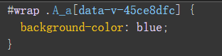

## 介绍vue

### 是什么

是一套构建用户界面的javascript**渐进式框架**,与其它大型框架不同的是，Vue 被设计为可以自底向上逐层应用

### mvvm

view：视图层（UI用户界面）

viewmodel：业务逻辑层（一切 js 可视为业务逻辑）

model：数据层（存储数据及对数据的处理如增删改查）

### 回顾vue2与vue3对比

#### 不同编程风格

vue2 options API

vue3 compostion API

#### 重写双向数据绑定

vue2
基于Object.defineProperty()实现

vue3 基于Proxy
proxy与Object.defineProperty(obj, prop, desc)方式相比有以下优势：

- 丢掉麻烦的备份数据

- 省去for in 循环
- 可以监听数组变化
- 代码更简化
- 可以监听动态新增的属性；
- 可以监听删除的属性 ；
- 可以监听数组的索引和 length 属性

#### Vue3 优化Vdom

在Vue2中,每次更新diff,都是全量对比,Vue3则只对比带有标记的,这样大大减少了非动态内容的对比消耗

**新增了 patch flag 标记**

```ts
TEXT = 1 // 动态文本节点
CLASS=1<<1,1 // 2//动态class
STYLE=1<<2，// 4 //动态style
PROPS=1<<3,// 8 //动态属性，但不包含类名和样式
FULLPR0PS=1<<4,// 16 //具有动态key属性，当key改变时，需要进行完整的diff比较。
HYDRATE_ EVENTS = 1 << 5，// 32 //带有监听事件的节点
STABLE FRAGMENT = 1 << 6, // 64 //一个不会改变子节点顺序的fragment
KEYED_ FRAGMENT = 1 << 7, // 128 //带有key属性的fragment 或部分子字节有key
UNKEYED FRAGMENT = 1<< 8, // 256 //子节点没有key 的fragment
NEED PATCH = 1 << 9, // 512 //一个节点只会进行非props比较
DYNAMIC_SLOTS = 1 << 10 // 1024 // 动态slot
HOISTED = -1 // 静态节点
BALL = -2
```

patch flag 的强大之处在于，当你的 diff 算法走到 \_createBlock 函数的时候，会忽略所有的静态节点，只对有标记的动态节点进行对比，而且在多层的嵌套下依然有效

#### Vue3 Tree shaking

简单来讲，就是在保持代码运行结果不变的前提下，去除无用的代码

在Vue2中，无论我们使用什么功能，它们最终都会出现在生产代码中。主要原因是Vue实例在项目中是单例的，捆绑程序无法检测到该对象的哪些属性在代码中被使用到

而Vue3源码引入tree shaking特性，将全局 API 进行分块。如果你不使用其某些功能，它们将不会包含在你的基础包中

就是比如你要用watch 就是import {watch} from 'vue' 其他的computed 没用到就不会给你打包减少体积

#### Vue3 Fragment

vue3 允许我们支持多个根节点

## 模板语法 & vue指令

### 模板插值语法

在script 声明一个变量可以直接在template 使用用法为{{变量名称}}

模板语法是可以编写条件运算的

运算也是支持的

操作API 也是支持的

### 指令

- v- 开头都是vue 的指令

- v-text 用来显示文本

- v-html 用来展示富文本

- v-if 用来控制元素的显示隐藏（切换真假DOM）

- v-else-if 表示 v-if 的“else if 块”。可以链式调用

- v-else v-if条件收尾语句

- v-show 用来控制元素的显示隐藏（display none block Css切换）

- v-on 简写@ 用来给元素添加事件

- v-bind 简写: 用来绑定元素的属性Attr

- v-model 双向绑定

- v-for 用来遍历元素

- v-on修饰符 冒泡案例

- v-once 性能优化只渲染一次

- v-memo 性能优化会有缓存

## Ref全家桶

### ref

接受一个内部值并返回一个[响应式](https://so.csdn.net/so/search?q=响应式&spm=1001.2101.3001.7020)且可变的 ref 对象。ref 对象仅有一个 `.value` property，指向该内部值

**注意被ref包装之后需要.value 来进行赋值**

### isRef

判断数据是不是ref对象

### shallowRef

创建一个跟踪自身 `.value` 变化的 ref，但不会使其值也变成响应式的

**注意shallowRef 浅层响应式 ref 深层次响应式 并且不能混着用,ref会影响shallowRef**

### triggerRef

强制更新页面DOM，ref底层调用了这个方法

### customRef

自定义ref

customRef 是个工厂函数要求我们返回一个对象 并且实现 get 和 set 适合去做防抖之类的

### 用例

```ts
<template>
    <h2> ref: {{ name }}{{ obj.name }}{{ obj1.name }}</h2>
    <hr>
    <h2> shallowRef: {{ obj2.name }}</h2>
    <hr>
    <h2 ref="h2"> customRef:{{ str }}</h2>
    <div ref="dom">我是dom</div>
    <button @click="change">按钮</button>
</template>
<script setup lang='ts'>
import { ref, shallowRef, customRef } from 'vue'
import type { Ref } from 'vue'

/**
 * ref返回的是类 修改取值必须加value
 * isRef 判断数据是不是ref类型
 * shallowRef 浅层响应式 ref 深层次响应式 并且不能混着用,ref会影响shallowRef
 * triggerRef强制更新收集的依赖，ref底层调用了
 * customRef 自定义ref 可以在数据连续更新时利用防抖做处理 优化性能
 */
const h2 = ref<HTMLElement>()
//获取dom元素 这里只是初始化写法 不能直接在setup中获取dom，因为DOM还没渲染上，此时为null
//应该放到onMounted生命周期中获取或者异步事件中去
const dom = ref<HTMLDivElement>()
interface Obj {
    name: string
}

let name = ref<string>('燚哥')
let obj = ref<Obj>({
    name: '爱美女'
})
let obj1: Ref<Obj> = ref({
    name: '黑丝'
})
let obj2 = shallowRef({
    name: '真贱'
})
let str = myRef<string>('大胸妹')
let obj3 = myRef<Obj>({ name: '小胸妹' })
function myRef<T>(value: T) {
    let timer: any
    return customRef((track, trigger) => {
        return {
            get() {
                // 收集依赖
                track()
                return value
            },
            set(newVal) {
                clearTimeout(timer)
                // 触发依赖更新
                timer = setTimeout(() => {
                    console.log('触发更新了');
                    value = newVal
                    timer = null
                    trigger()
                }, 500)
            }
        }
    })
}
const change = () => {
    // name.value = '燚哥巨大'
    // obj.value.name = '不爱美女'
    // obj1.value = {
    //     name: '直接赋值'
    // }
    obj2.value.name = '不贱'
    // triggerRef(obj2) //这里会更新shallowRef的值
    // console.log(isRef(name));
    // str.value = '胸不大'
    console.log(obj3.value.name);

    // 获取元素
    console.log(dom);
    console.log(h2);
}
</script>
<style scoped></style>
```

## Reactive全家桶

### reactive

用来绑定复杂的数据类型

ref 支持所有类型 ，reactive 支持引用类型

reactive 取值赋值不需要 .value

reactive proxy 不能直接赋值 否则会破坏响应式对象

### readonly

拷贝一份proxy对象将其设置为只读

### shallowReactive

只能对浅层的数据 如果是深层的数据只会改变值 不会改变视图

shallowReactive 浅层次 reactive 深层次 并且不能一起使用赋值，shallowReactive会受影响

### 用例

```ts
<template>

    <div v-for="item in list">{{ item }}</div>
    <div>{{ form }}</div>
    <div>{{ obj }}</div>
    <button @click="change">按钮</button>

</template>
<script setup lang='ts'>
import { reactive, shallowReactive } from 'vue'
/**
 * ref 支持所有类型 ，reactive 支持引用类型
 * reactive 取值赋值不需要 .value
 * reactive proxy 不能直接赋值 否则会破坏响应式对象
 * readonly 把对象所有属性变成只读,但是会受原始变量的影响
 * shallowReactive 浅层次 reactive 深层次 并且不能一起使用赋值，shallowReactive会受影响
 */

interface M {
    name: string,
    sex: string,
    age?: string
}
let form = reactive<M>({
    name: '燚哥',
    sex: '男',
})
let list = reactive([1, 2, 3])
let obj = shallowReactive({
    name: '李白',
    age: {
        num: 1
    }
})
// let read = readonly(form)
function change() {
    // list.splice(0, 3, 1)
    // obj.name = '2'
    obj.age.num = 123
}
// read.age = '123'
</script>
<style scoped></style>
```

## to全家桶

### toref

只能修改响应式对象的值 非响应式 更新数据视图毫无变化 toRefs一样

要将响应式对象中的某个属性单独提供给外部使用时--提取对象属性

### toRefs

可以帮我们批量创建ref对象主要是方便我们解构使用

解构响应式对象的属性

### toRaw

将响应式对象变为原始对象

### 用例

```ts
<template>
    <input type="text" v-model="name">
    <h2>toRefs:{{ name }}</h2>
    <input type="text" v-model="name1">
    <h2>toRef: {{ name1 }}</h2>
    <button @click="change">按钮</button>

</template>
<script setup lang='ts'>
import { reactive, toRefs, toRaw, toRef } from 'vue'
/**
 * toRef 只能修改响应式对象的值 非响应式 更新数据视图毫无变化 toRefs一样
 * toRef 要将响应式对象中的某个属性单独提供给外部使用时--提取对象属性
 * toRefs 解构响应式对象的属性
 * toRaw 将响应式对象变为原始对象
 */
const man: any = reactive({
    name: '燚哥',
    age: 18,
    sex: '男'
})
let obj = {
    name: '李白',
    age: 18,
}
// 手写实现toRefs
// const myToRefs = <T extends object>(object: T) => {
//     const map: any = {}
//     for (let k in object) {
//         map[k] = toRef(object, k)
//     }
//     return map
// }


let name1 = toRef(obj, 'name')
// const { name, sex, age } = myToRefs(man)
const { name } = toRefs(man)
const change = () => {
    console.log('toRef之后', name1);
    console.log('toRefs之后', name);
    console.log('toRaw之后', toRaw(man));
    //toRaw源码
    console.log('toRaw源码', man['__v_raw']);

}

</script>
<style scoped></style>
```

## computed

### 是什么

计算属性就是当依赖的属性的值发生变化的时候，才会触发他的更改，如果依赖的值，不发生变化的时候，使用的是缓存中的属性值

### 用例

```ts
<template>
    <div>姓:{{ firstName }}</div>
    <div>名:{{ lastName }}</div>
    <div>全名: {{ name }}</div>
</template>
<script setup lang='ts'>
import { ref, computed } from 'vue'

let firstName = ref('董')
let lastName = ref('长燚')
// 1.对象式写法
// let name = computed({
//     get() {
//         return firstName.value + lastName.value
//     },
//     set(newVal) {
//         [firstName.value, lastName.value] = newVal.split('-')
//     }
// })
// const change = () => {
//     name.value = '小-燚'
// }
// 2.函数式写法 只能支持一个getter函数不允许修改值
let name = computed(() => firstName.value + lastName.value)

</script>
<style scoped></style>
```

## watch

### 是什么

- watch 需要侦听特定的数据源，并在单独的回调函数中执行副作用

- watch第一个参数监听源

- watch第二个参数回调函数cb（newVal,oldVal）

- watch第三个参数一个options配置项是一个对象{

- immediate:true 是否立即调用一次

- deep:true 是否开启深度监听

- 监听ref对象都开启深度监听 这里面新值和旧值是一样的
- 监听reactive对象开启deep与不开启deep是一样的 都能监听到
- 监听对象的一个属性时，传入的是一个函数 ()=> data1.name

## watchEffect

### 是什么

立即执行传入的一个函数，同时[响应式](https://so.csdn.net/so/search?q=响应式&spm=1001.2101.3001.7020)追踪其依赖，并在其依赖变更时重新运行该函数,传入函数里面参数是一个函数,在数据变化之前调用。

如果用到message 就只会监听message 就是用到几个监听几个 而且是非惰性 会默认调用一次

## BEM架构

### 是什么

他是一种css架构 **oocss 实现的一种 （面向对象css） ，**`BEM`实际上是`block`、`element`、`modifier`的缩写，分别为块层、元素层、修饰符层，element UI 也使用的是这种架构

BEM 命名约定的模式是

```less
.block {
}

.block__element {
}

.block--modifier {
}
```

## 父子组件传值

### 父组件传值

父组件通过[v-bind](https://so.csdn.net/so/search?q=v-bind&spm=1001.2101.3001.7020)绑定一个数据，传递字符串类型不需要加v-bind，传递非字符串类型需要加v-bind 简写 冒号

### 子组件接受值

通过[defineProps](https://so.csdn.net/so/search?q=defineProps&spm=1001.2101.3001.7020) 来接受 **defineProps是无须引入的直接使用即可**

#### js写法

```ts
 const props = defineProps({
     title: {
        type: String,
        default: '默认值'
     },
     arr:{
        type:number[],
        default:[66]
     }
 })
```

#### ts写法

TS 特有的默认值方式

withDefaults是个函数也是无须引入开箱即用接受一个props函数第二个参数是一个对象设置默认值

```ts
const props = withDefaults(
  defineProps<{
    title: String
    arr: number[]
  }>(),
  {
    title: () => '默认值',
    arr: () => [66]
  }
)
```

### 子组件给父组件传参

是通过defineEmits派发一个事件

我们在子组件绑定了一个click 事件 然后通过defineEmits 注册了一个自定义事件

点击click 触发 emit 去调用我们注册的事件 然后传递参数

#### js写法

```ts
<template>
<button @click="send">给父组件传值</button
</template>
<script setup lang='ts'>
const emit = defineEmits('test')
const send = () => {
    emit('test', '小燚')
}
</script>
<style scoped></style>
```

#### ts写法

```ts
<template>
<button @click="send">给父组件传值</button>
</template>
<script setup lang='ts'>
const emit = defineEmits<{
    (e:'test',name:string):void
}>()
const send = () => {
    emit('test', '小燚')
}
</script>
<style scoped></style>
```

### 父组件接受值

接受子组件派发的事件 后面是我们自己定义的函数名称

会把参数返回过来

```ts
<template>
<Child @test='getTest'><Child/>
</template>
<script setup lang='ts'>
const getTest = (params) => {
    console.log(params)
}
</script>
<style scoped></style>
```

### 对外暴露变量与方法

父组件想要读到子组件的属性，子组件可以通过 defineExpose暴露

## 组件

### 全局组件

在main.ts 引入我们的组件跟随在createApp(App) 后面 切记不能放到mount 后面这是一个链式调用用

其次调用 component 第一个参数组件名称 第二个参数组件实例

```ts
import { createApp } from 'vue'
import App from './App.vue'
import './assets/css/reset/index.less'
import Card from './components/Card/index.vue'

createApp(App).component('Card', Card).mount('#app')
```

### 局部组件

就是在一个组件内（A） 通过import 去引入别的组件(B) 称之为局部组件

因为B组件只能在A组件内使用 所以是局部组件

如果C组件想用B组件 就需要C组件也手动import 引入 B 组件

### 递归组件

```ts
<template>
    <div @click.stop="clickTap(item, $event)" class="tree" v-for="item in data">
        <input v-model="item.checked" type="checkbox">
        &nbsp;<span @click.stop="collapse(item)">{{ item.name }}</span>
        <div :class="isHideObj">
            <Tree v-if="item?.children?.length" :data="item.children"></Tree>
        </div>

    </div>

</template>
<script setup lang='ts'>
import { defineProps, ref } from 'vue'
interface Tree {
    name: string,
    checked: boolean,
    children?: Tree[]
}
defineProps<{
    data?: Tree[]
}>()
let isHideObj = ref({
    isHide: false
})

const clickTap = (item: any, e: Event) => {
    console.log(e.target, item);


}
// 折叠
const collapse = (item: any) => {
    if (item.children && item.children.length > 0) {
        isHideObj.value.isHide = !isHideObj.value.isHide

    }
}


</script>
<style scoped>
.tree {
    margin-left: 10px;
}

.isHide {
    display: none;
}
</style>
```

### 动态组件

什么是动态组件 就是：让多个组件使用同一个挂载点，并动态切换，这就是动态组件。

在挂载点使用[component](https://so.csdn.net/so/search?q=component&spm=1001.2101.3001.7020)标签，然后使用[v-bind](https://so.csdn.net/so/search?q=v-bind&spm=1001.2101.3001.7020):is=”组件”

#### 注意事项

- 在Vue2 的时候is 是通过组件名称切换的 在Vue3 setup 是通过组件实例切换的
- 如果你把组件实例放到Reactive Vue会给你一个警告**runtime-core.esm-bundler.js:38 [Vue warn]: Vue received a Component which was made a reactive object. This can lead to unnecessary performance overhead, and should be avoided by marking the component with `markRaw` or using `shallowRef` instead of `ref`.**
  **Component that was made reactive**:
- 这是因为reactive 会进行proxy 代理 而我们组件代理之后毫无用处 节省性能开销 推荐我们使用shallowRef 或者 markRaw 跳过proxy 代理

#### 用例

```ts
<template>
    <div style="display: flex;">
        <div @click="change(item, index)" :class="[active == index ? 'active' : '']" class="tabs"
            v-for="(item, index) in data">
            <div>{{ item.name }}</div>
        </div>
    </div>
    <component :is="comId"></component>
</template>

<script setup lang='ts'>
import A from './A.vue'
import B from './B.vue'
import C from './C.vue'
import { ref, reactive, markRaw, shallowRef } from 'vue';
// 动态组件写法一
let comId = shallowRef(A)
let active = ref(0)
let data = reactive([
    {
        name: 'A组件',
        // com: markRaw(A)写法一
        com: 'Avue'//动态组件写法二
    },
    {
        name: 'B组件',
        com: markRaw(B) //动态组件写法一
    },
    {
        name: 'C组件',
        com: C // 响应式组件Vue会有报错警告，需要用 markRaw或者shallowRef包裹
    },
])
const change = (item: any, i: number) => {
    comId.value = item.com
    console.log(item.com);

    console.log(comId.value);

    active.value = i
}


</script>

<script lang="ts">
import Avue from './A.vue'
import Bvue from './B.vue'
import Cvue from './C.vue'
export default {
    components: {
        Avue,
        Bvue,
        Cvue
    },
}

</script>
<style scoped>
.tabs {
    border: 1px solid #ccc;
    padding: 5px 10px;
    margin: 5px;
    cursor: pointer;
}

.active {
    background-color: skyblue;
}
</style>
```

### 组件定义名称方式

- 在增加一个script 通过 export 添加name
- 直接使用文件名当组件名
- 使用插件 unplugin-vue-define-options

## 插槽

### 是什么

插槽就是子组件中的提供给父组件使用的一个[占位符](https://so.csdn.net/so/search?q=占位符&spm=1001.2101.3001.7020)，用<slot></slot> 表示，父组件可以在这个占位符中填充任何模板代码，如 HTML、组件等，填充的内容会替换子组件的<slot></slot>标签。

### 匿名插槽

在子组件放置一个插槽

```ts
<template>
    <div>
       <slot></slot>
    </div>
</template>
```

父组件使用插槽

```ts
 <Dialog>
     <template v-slot>
         <div>2132</div>
     </template>
</Dialog>
```

### 具名插槽

具名插槽其实就是给插槽取个名字。一个子组件可以放多个插槽，而且可以放在不同的地方，而父组件填充内容时，可以根据这个名字把内容填充到对应插槽中

```ts
    <div>
        <slot name="header"></slot>
        <slot></slot>

        <slot name="footer"></slot>
    </div>
```

父组件使用需对应名称

v-slot:header可以简写成#header

```ts
        <Dialog>
            <template v-slot:header>
               <div>1</div>
           </template>
           <template v-slot>
               <div>2</div>
           </template>
           <template v-slot:footer>
               <div>3</div>
           </template>
        </Dialog>
```

### 作用域插槽

在子组件[动态绑定](https://so.csdn.net/so/search?q=动态绑定&spm=1001.2101.3001.7020)参数 派发给父组件的slot去使用

```ts
    <div>
        <slot name="header"></slot>
        <div>
            <div v-for="item in 100">
                <slot :data="item"></slot>
            </div>
        </div>

        <slot name="footer"></slot>
    </div>
```

通过结构方式取值

v-slot="{ data }"可以简写成#defatult="{ data }"

```ts
         <Dialog>
            <template #header>
                <div>1</div>
            </template>
            <template #default="{ data }">
                <div>{{ data }}</div>
            </template>
            <template #footer>
                <div>3</div>
            </template>
        </Dialog>
```

### 动态插槽

动态插槽 #[]

插槽可以是一个变量名

```ts
        <Dialog>
            <template #[name]>
                <div>
                    23
                </div>
            </template>
        </Dialog>
const name = ref('header')
```

## 异步组件

### 是什么

在大型应用中，我们可能需要将应用分割成小一些的代码块 并且减少主包的体积

这时候就可以使用异步组件

异步组件需要defineAsyncComponent调用引入

使用的时候必须包含在Suspense

通过import 函数模式引入的东西 都会进行代码拆解分包

### 用例

```vue
<template>
  <Suspense>
    <template #default>
      <SyncA></SyncA>
    </template>
    <template #fallback><B></B></template>
  </Suspense>
</template>

<script setup lang="ts">
import { defineAsyncComponent } from 'vue'
import B from './B.vue'

const SyncA = defineAsyncComponent(() => import('./A.vue'))
/**
 * 异步组件需要defineAsyncComponent调用引入
 * 使用的时候必须包含在Suspense
 * 通过import 函数模式引入的东西 都会进行代码拆解分包
 */
// 完整写法
// const SyncA = defineAsyncComponent({
//     // 加载函数
//     loader: () => import('./A.vue'),

//     // 加载异步组件时使用的组件
//     loadingComponent: B,
//     // 展示加载组件前的延迟时间，默认为 200ms
//     delay: 200,

//     // 加载失败后展示的组件
//     errorComponent: B,
//     // 如果提供了一个 timeout 时间限制，并超时了
//     // 也会显示这里配置的报错组件，默认值是：Infinity
//     timeout: 3000
// })
console.log(SyncA, '异步组件')
</script>

<style scoped>
.tabs {
  border: 1px solid #ccc;
  padding: 5px 10px;
  margin: 5px;
  cursor: pointer;
}

.active {
  background-color: skyblue;
}
</style>
```

## Teleport传送组件

### 是什么

Teleport 是一种能够将我们的模板渲染至指定DOM节点，不受父级style、v-show等属性影响，但data、prop数据依旧能够共用的技术；类似于 React 的 Portal。

主要解决的问题 因为Teleport节点挂载在其他指定的DOM节点下，完全不受父级style样式影响
通过to 属性 插入指定元素位置 to="body" 便可以将`Teleport` 内容传送到指定位置

也可以自定义传送位置 支持 class id等 选择器

```vue
<Teleport to="body">
    <Loading></Loading>
</Teleport>
```

## keep-alive缓存组件

### 是什么

有时候我们不希望组件被重新渲染影响使用体验；或者处于性能考虑，避免多次重复渲染降低性能。而是希望组件可以缓存下来,维

持当前的状态。这时候就需要用到`keep-alive`组件

开启keep-alive 生命周期的变化

- 初次进入时： onMounted> onActivated
- 退出后触发 deactivated
- 再次进入：
- 只会触发 onActivated
- 事件挂载的方法等，只执行一次的放在 onMounted中；组件每次进去执行的方法放在 onActivated中

**`include` 和 `exclude`**

include 和 exclude 允许组件有条件地缓存。二者都可以用逗号分隔字符串、正则表达式或一个数组来表示

include: [String, RegExp, Array], // 配置了该属性，那么只有名称匹配的组件会被缓存

exclude: [String, RegExp, Array], // 配置了该属性，那么任何名称匹配的组件都不会被缓存

max: [String, Number]// 最多可以缓存多少组件实例

```vue
<keep-alive :include="" :exclude="" :max=""></keep-alive>
```

## 动画

### 是什么

Vue 提供了 transition 的封装组件，在下列情形中，可以给任何元素和组件添加进入/离开过渡:

- 条件渲染 (使用 v-if)
- 条件展示 (使用 v-show)
- 动态组件
- 组件根节点

### transition

#### 过渡的类名

在进入/离开的过渡中，会有 6 个 class 切换，**并且写在需要动画的静态样式的后面，防止样式覆盖，没有动画效果**

v-enter-from：定义进入过渡的开始状态。在元素被插入之前生效，在元素被插入之后的下一帧移除。

v-enter-active：定义进入过渡生效时的状态。在整个进入过渡的阶段中应用，在元素被插入之前生效，在过渡/动画完成之后移除。这个类可以被用来定义进入过渡的过程时间，延迟和曲线函数。

v-enter-to：定义进入过渡的结束状态。在元素被插入之后下一帧生效 (与此同时 v-enter-from 被移除)，在过渡/动画完成之后移除。

v-leave-from：定义离开过渡的开始状态。在离开过渡被触发时立刻生效，下一帧被移除。

v-leave-active：定义离开过渡生效时的状态。在整个离开过渡的阶段中应用，在离开过渡被触发时立刻生效，在过渡/动画完成之后移除。这个类可以被用来定义离开过渡的过程时间，延迟和曲线函数。

v-leave-to：离开过渡的结束状态。在离开过渡被触发之后下一帧生效 (与此同时 v-leave-from 被移除)，在过渡/动画完成之后移除。

#### 自定义过渡 class 类名

- enter-from-class
- enter-active-class
- enter-to-class
- leave-from-class
- leave-active-class
- leave-to-class

自定义过度时间 单位毫秒

你也可以分别指定进入和离开的持续时间

```vue
<transition :duration="1000">...</transition>
<transition :duration="{ enter: 500, leave: 800 }">...</transition>
```

#### 生命周期8个

```ts
  @before-enter="beforeEnter" //对应enter-from
  @enter="enter"//对应enter-active
  @after-enter="afterEnter"//对应enter-to
  @enter-cancelled="enterCancelled"//显示过度打断
  @before-leave="beforeLeave"//对应leave-from
  @leave="leave"//对应enter-active
  @after-leave="afterLeave"//对应leave-to
  @leave-cancelled="leaveCancelled"//离开过度打断
```

当只用 JavaScript 过渡的时候，在 **`enter` 和 `leave` 钩子中必须使用 `done` 进行回调**

```ts
const beforeEnter = (el: Element) => {
  console.log('进入之前from', el)
}
const Enter = (el: Element, done: Function) => {
  console.log('过度曲线')
  setTimeout(() => {
    done()
  }, 3000)
}
const AfterEnter = (el: Element) => {
  console.log('to')
}
```

#### appear

通过这个属性可以设置初始节点过度 就是页面加载完成就开始动画 对应三个状态

```ts
appear-active-class=""
appear-from-class=""
appear-to-class=""
appear
```

### transition-group

怎么同时渲染整个列表，比如使用 `v-for`？在这种场景下，我们会使用 `<transition-group>` 组件

- 默认情况下，它不会渲染一个包裹元素，但是你可以通过 `tag` attribute 指定渲染一个元素。
- [过渡模式](https://v3.cn.vuejs.org/guide/transitions-enterleave.html#过渡模式)不可用，因为我们不再相互切换特有的元素。
- 内部元素**总是需要**提供唯一的 `key` attribute 值。
- CSS 过渡的类将会应用在内部的元素中，而不是这个组/容器本身。

```vue
<transition-group>
     <div style="margin: 10px;" :key="item" v-for="item in list">{{ item }</div>
</transition-group>
```

`<transition-group>` 组件还有一个特殊之处。除了进入和离开，它还可以为定位的改变添加动画。只需了解新增的 v-move 类就可以使用这个新功能，它会应用在元素改变定位的过程中。像之前的类名一样，它的前缀可以通过 name attribute 来自定义，也可以通过 move-class attribute 手动设置

```vue
<template>
  <div>
    <button @click="shuffle">Shuffle</button>
    <transition-group class="wraps" name="mmm" tag="ul">
      <li class="cell" v-for="item in items" :key="item.id">{{ item.number }}</li>
    </transition-group>
  </div>
</template>

<script setup lang="ts">
import _ from 'lodash'
import { ref } from 'vue'
let items = ref(
  Array.apply(null, { length: 81 } as number[]).map((_, index) => {
    return {
      id: index,
      number: (index % 9) + 1
    }
  })
)
const shuffle = () => {
  items.value = _.shuffle(items.value)
}
</script>

<style scoped lang="less">
.wraps {
  display: flex;
  flex-wrap: wrap;
  width: calc(25px * 10 + 9px);
  .cell {
    width: 25px;
    height: 25px;
    border: 1px solid #ccc;
    list-style-type: none;
    display: flex;
    justify-content: center;
    align-items: center;
  }
}

.mmm-move {
  transition: transform 0.8s ease;
}
</style>
```

## 依赖注入

### 是什么

通常，当我们需要从父组件向子组件传递数据时，我们使用 props。想象一下这样的结构：有一些深度嵌套的组件，而深层的子组件只需要父组件的部分内容。在这种情况下，如果仍然将 prop 沿着组件链逐级传递下去，可能会很麻烦。

官网的解释很让人疑惑，那我翻译下这几句话：

provide 可以在祖先组件中指定我们想要提供给后代组件的数据或方法，而在任何后代组件中，我们都可以使用 inject 来接收 provide 提供的数据或方法。


### 传递数据

```ts
import { provide, ref } from 'vue'
let val = ref('爷爷的数据')
provide('key', val)
```

### 接受数据

```ts
import { inject } from 'vue'
import type { Ref } from 'vue'

let val = inject<Ref<string>>('key')
```

## 兄弟组件传参和bus

### 借助父组件传参

```vue
<template>
  <div>
    <A @on-click="getFalg"></A>
    <B :flag="Flag"></B>
  </div>
</template>

<script setup lang="ts">
import A from './components/A.vue'
import B from './components/B.vue'
import { ref } from 'vue'
let Flag = ref<boolean>(false)
const getFalg = (flag: boolean) => {
  Flag.value = flag
}
</script>

<style></style>
```

### Event Bus

```ts
type BusClass<T> = {
  emit: (name: T) => void
  on: (name: T, callback: Function) => void
}
type BusParams = string | number | symbol
type List = {
  [key: BusParams]: Array<Function>
}
class Bus<T extends BusParams> implements BusClass<T> {
  list: List
  constructor() {
    this.list = {}
  }
  emit(name: T, ...args: Array<any>) {
    let eventName: Array<Function> = this.list[name]
    eventName.forEach((ev) => {
      ev.apply(this, args)
    })
  }
  on(name: T, callback: Function) {
    let fn: Array<Function> = this.list[name] || []
    fn.push(callback)
    this.list[name] = fn
  }
}

export default new Bus<number>()
```

## tsx

### 是什么

我们之前呢是使用Template去写我们模板。现在可以扩展另一种风格[TSX](https://so.csdn.net/so/search?q=TSX&spm=1001.2101.3001.7020)风格

vue2 的时候就已经支持[jsx](https://so.csdn.net/so/search?q=jsx&spm=1001.2101.3001.7020)写法，只不过不是很友好，随着vue3对typescript的支持度，tsx写法越来越被接受

### 安装插件

npm install @vitejs/plugin-vue-jsx -D

vite.config.ts 配置


### 修改tsconfig.json 配置文件

```ts
"jsx": "preserve",
"jsxFactory": "h",
"jsxFragmentFactory": "Fragment",
```

### 写法一

```tsx
export default function () {
  return <div>你好啊tsx</div>
}
```

### 写法二

```tsx
import { defineComponent, ref } from 'vue'
// 第二种写法
defineComponent({
  data() {
    return {
      age: 23
    }
  },
  render() {
    return <div>你好啊tsx{this.age}</div>
  }
})
```

### 写法三

- ref 在template 中会自动解包 tsx不会 需要ref.value
- v-if 在tsx不支持 使用三元表达式代替
- v-for 也不支持 用map代替
- v-bind 不支持 用 {}代替
- props emit
- 插槽 需要传个函数给子组件

```tsx
import { defineComponent, ref } from 'vue'
const Child = (props, { slots }) => {
  // 解构传过来的props属性 ,不能直接在tsx中写props
  let { p1, slot } = props
  // slot 传的是个对象,也当成了插槽使用,其实slots只是为了让tsx中插槽看起来合理一点,
  // 通过props传一个插槽也是可以的
  console.log(slot)

  return (
    <>
      <div>{p1}</div>
      <div>{slot.body?.()}</div>
      <div>{slots.default ? slots.default() : '默认值'}</div>
      <div>{slots.body?.()}</div>
    </>
  )
}
export default defineComponent({
  props: {
    name: {
      type: String
    }
  },
  emits: ['cb'],
  setup(props, { emit }) {
    let data = ref('tsx')
    const slot = {
      default: () => <div>我是插槽内容1</div>,
      body: () => <div>我是插槽内容2</div>
    }
    const v = ref<string>('')
    const add = () => {
      console.log('子组件触发了emit', this)
      emit('cb', '123')
    }
    return () => (
      <div>
        <input v-model={v.value} type="text" />
        <div>{v.value}</div>
        <hr />
        <Child v-slot={slot} p1="1" slot={slot}></Child>
        <div>props:{props.name}</div>
        <div> 你好啊{data.value}</div>
        <button onClick={add}>自定义事件</button>
      </div>
    )
  }
})
```

## v-model

### 是什么

v-model 其实是一个语法糖 通过props 和 emit组合而成的，实现数据的双向绑架

v-model绑定组件

默认值的改变

- prop：`value` -> `modelValue`；
- 事件：`input` -> `update:modelValue`；
- `v-bind` 的 `.sync` 修饰符和组件的 `model` 选项vue3已移除
- 新增 支持多个v-model
- 新增 支持自定义 修饰符 Modifiers `modelModifiers 写法必须式 propsName+Modifiers`

### 用例

```vue
<template>
  父组件:{{ data.name }} --{{ text }}
  <hr />
  <child v-model.isbt="data" v-model:textVal="text"></child>
</template>
<script setup lang="ts">
import child from './child.vue'
import { ref } from 'vue'
/**
 *  v-model绑定组件
 *  vue2 value vue3 modelValue
 *  vue3支持多个v-model
 *  vue3支持自定义修饰符
 * 自定义修饰符isbt
 */
let data = ref<{ name: string }>({
  name: '李白'
})
let text = ref('123')
</script>
<style scoped></style>
```

```vue
<template>
  子组件:<input type="text" v-model="modelValue.name" />
  <div>{{ textVal }}</div>
  <div @click="fn()">按钮</div>
</template>
<script setup lang="ts">
// modelModifiers 写法必须式 propsName+Modifiers

interface obj {
  name: string
}
const props = defineProps<{
  modelValue: obj
  textVal: string
  modelModifiers?: {
    isbt: boolean
  }
}>()

const emit = defineEmits(['update:modelValue', 'update:textVal'])
const fn = () => {
  console.log(props?.modelModifiers.isbt)

  emit(
    'update:modelValue',
    props?.modelModifiers?.isbt
      ? {
          name: props.modelValue.name + '我是变态'
        }
      : { name: '我不是变态' }
  )
  emit('update:textVal', '456')
}
</script>
<style scoped></style>
```

## 拓展vue2的model选项

### 是什么

vue2中允许一个自定义组件在使用 `v-model` 时定制 prop 和 event。

默认情况下，一个组件上的 `v-model` 会把 `value` 用作 prop 且把 `input` 用作 event，

但是一些输入类型比如单选框和复选框按钮可能想使用 `value` prop 来达到不同的目的。

使用 `model` 选项可以回避这些情况产生的冲突。

### 用例

```vue
<script>
Vue.component('my-checkbox', {
  model: {
    prop: 'checked',
    event: 'change'
  },
  props: {
    // this allows using the `value` prop for a different purpose
    value: String,
    // use `checked` as the prop which take the place of `value`
    checked: {
      type: Number,
      default: 0
    }
  }
  // ...
})
</script>
<my-checkbox v-model="foo" value="some value"></my-checkbox>
```

上述代码相当于

```vue
<my-checkbox
  :checked="foo"
  @change="
    (val) => {
      foo = val
    }
  "
  value="some value"
>
</my-checkbox>
```

## 拓展vue2的.sync

### 是什么

实现props的双向绑定，可以修改props

- prop：`propsName`；
- 事件： `update:propsName`；

### 用例

```vue
<!--  .sync 可以写多个-->
<counter :counter.sync="appCounter" :why.sync="appWhy"></counter>
```

```vue
<template>
  <div>
    <h2>Counter: {{ counter }}</h2>
    <button @click="changeCounter">修改counter</button>

    <!-- why绑定 -->
    <hr />
    <h2>why: {{ why }}</h2>
    <button @click="changeWhy">修改why的值</button>
  </div>
</template>

<script>
export default {
  props: {
    counter: {
      type: Number,
      default: 0
    },
    why: {
      type: String,
      default: ''
    }
  },
  methods: {
    changeCounter() {
      this.$emit('update:counter', 9999)
    },
    changeWhy() {
      this.$emit('update:why', 'kobe')
    }
  }
}
</script>

<style scoped></style>
```

## 自定义指令

### 是什么

vue里提供的自定义指令directive

### 钩子函数

**Vue3指令的钩子函数**

created 元素初始化的时候
beforeMount 指令绑定到元素后调用 只调用一次
mounted 元素插入父级dom调用
beforeUpdate 元素被更新之前调用
update 这个周期方法被移除 改用updated
beforeUnmount 在元素被移除前调用
unmounted 指令被移除后调用 只调用一次
**vue2指令的钩子函数**

bind inserted update componentUpdated unbind

### 生命周期钩子参数详解

第一个 el 当前绑定的DOM 元素

第二个 binding

instance：使用指令的组件实例。
value：传递给指令的值。例如，在 v-my-directive="1 + 1" 中，该值为 2。
oldValue：先前的值，仅在 beforeUpdate 和 updated 中可用。无论值是否有更改都可用。
arg：传递给指令的参数(如果有的话)。例如在 v-my-directive:foo 中，arg 为 "foo"。
modifiers：包含修饰符(如果有的话) 的对象。例如在 v-my-directive.foo.bar 中，修饰符对象为 {foo: true，bar: true}。
dir：一个对象，在注册指令时作为参数传递。例如，在以下指令中

第三个 当前元素的虚拟DOM 也就是Vnode

第四个 prevNode 上一个虚拟节点，仅在 beforeUpdate 和 updated 钩子中可用

### 用例

```vue
<template>
  <button @click="show = !show">开关{{ show }} ----- {{ title }}</button>
  <Dialog v-move-directive="{ background: 'green', flag: show }"></Dialog>
</template>
<script setup lang="ts">
const vMoveDirective: Directive = {
  created: () => {
    console.log('初始化====>')
  },
  beforeMount(...args: Array<any>) {
    // 在元素上做些操作
    console.log('初始化一次=======>')
  },
  mounted(el: any, dir: DirectiveBinding<Value>) {
    el.style.background = dir.value.background
    console.log('初始化========>')
  },
  beforeUpdate() {
    console.log('更新之前')
  },
  updated() {
    console.log('更新结束')
  },
  beforeUnmount(...args: Array<any>) {
    console.log(args)
    console.log('======>卸载之前')
  },
  unmounted(...args: Array<any>) {
    console.log(args)
    console.log('======>卸载完成')
  }
}
</script>
```

### 指令简写

在 `mounted` 和 `updated` 时触发相同行为，而不关心其他的钩子函数。那么你可以通过将这个函数模式实现

```vue
<template>
  <div>
    <input v-model="value" type="text" />
    <A v-move="{ background: value }"></A>
  </div>
</template>

<script setup lang="ts">
import A from './components/A.vue'
import { ref, Directive, DirectiveBinding } from 'vue'
let value = ref<string>('')
type Dir = {
  background: string
}
const vMove: Directive = (el, binding: DirectiveBinding<Dir>) => {
  el.style.background = binding.value.background
}
</script>

<style></style>
```

## 自定义hooks

### 是什么

主要用来处理复用代码逻辑的一些封装

这个在vue2 就已经有一个东西是Mixins

mixins就是将这些多个相同的逻辑抽离出来，各个组件只需要引入mixins，就能实现一次写代码，多组件受益的效果。

弊端就是 会涉及到覆盖的问题

组件的data、methods、filters会覆盖mixins里的同名data、methods、filters。

第二点就是 变量来源不明确（隐式传入），不利于阅读，使代码变得难以维护。

Vue3 的 hook函数 相当于 vue2 的 mixin, 不同在与 hooks 是函数
Vue3 的 hook函数 可以帮助我们提高代码的复用性, 让我们能在不同的组件中都利用 hooks 函数

## 定义全局函数和变量

### globalProperties

由于[Vue3](https://so.csdn.net/so/search?q=Vue3&spm=1001.2101.3001.7020) 没有Prototype 属性 使用 app.config.globalProperties 代替 然后去定义变量和函数

**vue2**

```ts
// 之前 (Vue 2.x)
Vue.prototype.$http = () => {}
```

**vue3**

```ts
// 之后 (Vue 3.x)
const app = createApp({})
app.config.globalProperties.$http = () => {}
```

## 插件

### 是什么

插件是自包含的代码，通常向 Vue 添加全局级功能。你如果是一个对象需要有install方法Vue会帮你自动注入到install 方法 你如果是function 就直接当install 方法去使用

### 使用插件

在使用 `createApp()` 初始化 Vue 应用程序后，你可以通过调用 `use()` 方法将插件添加到你的应用程序中

### 用例

实现一个Loading

```ts
import { createVNode, render, VNode, App } from 'vue'
import Loading from './index.vue'

export default {
  install(app: App) {
    //createVNode vue提供的底层方法 可以给我们组件创建一个虚拟DOM 也就是Vnode
    const vnode: VNode = createVNode(Loading)
    //render 把我们的Vnode 生成真实DOM 并且挂载到指定节点
    render(vnode, document.body)
    // Vue 提供的全局配置 可以自定义
    app.config.globalProperties.$loading = {
      show: () => vnode.component?.exposed?.show(),
      hide: () => vnode.component?.exposed?.hide()
    }
  }
}
```

```vue
<template>
  <div v-show="isShow" class="loading">
    <div class="loading-content">Loading...</div>
  </div>
</template>

<script setup lang="ts">
import { ref } from 'vue'
const isShow = ref(false) //定位loading 的开关

const show = () => {
  isShow.value = true
}
const hide = () => {
  isShow.value = false
}
//对外暴露 当前组件的属性和方法
defineExpose({
  isShow,
  show,
  hide
})
</script>

<style scoped lang="less">
.loading {
  position: fixed;
  inset: 0;
  background: rgba(0, 0, 0, 0.8);
  display: flex;
  justify-content: center;
  align-items: center;

  &-content {
    font-size: 30px;
    color: #fff;
  }
}
</style>
```

### Vue use 源码手写

```ts
import { App } from 'vue'
import { app } from './main'
interface Use {
  install: (app: App, ...options: any[]) => void
}
const installList = new Set()
export function myUse<T extends Use>(plugin: T, ...options: any[]) {
  if (installList.has(plugin)) {
    console.error('不好意思有插件了')
  } else {
    installList.add(plugin)
    plugin.install(app, ...options)
  }
}
```

## vue3UI库

Element UI Plus , Ant Design Vue , Iview, vant

## scoped和样式穿透

### scoped原理

vue中的scoped 通过在DOM结构以及css样式上加唯一不重复的标记:data-v-hash的方式，以保证唯一（而这个工作是由过PostCSS转译实现的），达到样式私有化模块化的目的。

scoped三条渲染规则：

- 给HTML的DOM节点加一个不重复data属性(形如：data-v-123)来表示他的唯一性

- 在style中写的每一句css选择器的末尾（编译后的生成的css语句）加一个当前组件的data属性选择器（如[data-v-123]）来私有化样式
- 如果组件内部包含有其他组件，只会给其他组件的最外层标签加上当前组件的data属性

**注意第二条规则与第三条规则会发生冲突**

比如想给当前组件的子组件修改样式，发现会添加css选择器的末尾会添加当前组件的data属性选择器，但是只会在子组件最外层添加当前组件的data属性选择器，当前组件写的每一句css选择器使用的当前的data属性选择器，子组件的内层样式没有当前组件的data属性选择器，然后就会命中不了子组件内层样式，最外层可以

### 样式穿透原理

**Vue 提供了样式穿透`:deep()` 他的作用就是用来改变 属性选择器的位置**

vue2通过`/deep/` vue3通过`:deep()`

### 用例

结构

当前组件属性 data-v-45ce8dfc

子组件最外层添加了属性 data-v-336f96a7 data-v-45ce8dfc

子组件内层属性只有data-v-336f96a7


子组件样式


父组件中修改子组件样式（原因是子组件的data属性选择器没有父组件data属性选择器）



添加样式穿透`:deep()`


## css Style完整新特性

上一章已经讲过了`:deep()`,其实还有两个选择器可以补充

### 插槽选择器

子组件修改插槽样式 需要用`:slotted`

### 全局选择器

```css
<style lang="less" scoped>
:global(div){
    color:red
}
</style>
```

### 动态css

单文件组件的 `<style>` 标签可以通过 `v-bind` 这一 CSS 函数将 CSS 的值关联到动态的组件状态上

如果是对象 v-bind 括号内请加引号

```vue
<template>
  <div class="div">小满是个弟弟</div>
</template>

<script lang="ts" setup>
import { ref } from 'vue'
const red = ref<string>('red')
</script>

<style lang="less" scoped>
.div {
  color: v-bind(red);
}
</style>
```

### css module

`<style module>` 标签会被编译为 CSS Modules 并且将生成的 CSS 类作为 $style 对象的键暴露给组件

```vue
<template>
  <div :class="$style.red">小满是个弟弟</div>
</template>

<style module>
.red {
  color: red;
  font-size: 20px;
}
</style>
```

自定义注入名称（多个可以用数组）

你可以通过给 `module` attribute 一个值来自定义注入的类对象的 property 键

```vue
<template>
  <div :class="[zs.red, zs.border]">小满是个弟弟</div>
</template>

<style module="zs">
.red {
  color: red;
  font-size: 20px;
}
.border {
  border: 1px solid #ccc;
}
</style>
```

与组合式 API 一同使用

注入的类可以通过 useCssModule API 在 setup() 和 `<script setup>` 中使用。对于使用了自定义注入名称的 `<style module>` 模块，useCssModule 接收一个对应的 module attribute 值作为第一个参数

```vue
<template>
  <div :class="[zs.red, zs.border]">小满是个弟弟</div>
</template>

<script setup lang="ts">
import { useCssModule } from 'vue'
const css = useCssModule('zs')
</script>

<style module="zs">
.red {
  color: red;
  font-size: 20px;
}
.border {
  border: 1px solid #ccc;
}
</style>
```

## nextTick

### 是什么

例如我们显示器是60FPS

那浏览器绘制一帧就是1000 / 60 ≈ 16.6ms

那浏览器这一帧率做了什么

1.处理用户的事件，就是event 例如 click，input change 等。

2.执行定时器任务

3.执行 requestAnimationFrame

4.执行dom 的回流与重绘

5.计算更新图层的绘制指令

6.绘制指令合并主线程 如果有空余时间会执行 requestidlecallback

所以 一个Tick 就是去做了这些事

vue更新dom是异步的 数据更新是同步

我们本次执行的代码是同步代码

当我们操作dom 的时候发现数据读取的是上次的 就需要使用nextIick

### 写法一

```ts
//回调函数形式
nextTick(()=>{
    ...处理逻辑
})
```

写法二

```ts
//2.async await 写法
await nextTick()
...处理逻辑
```

## 函数式编程

### 是什么

Vue单文件组件编译是需要过程，他会经过parser -> transform -> generate 而h函数直接跳过这三个阶段，所以性能上有很大的帮助。

主要会用到h函数

h 接收三个参数

- type 元素的类型
- propsOrChildren 数据对象, 这里主要表示(props, attrs, dom props, class 和 style)
- children 子节点

h函数拥有多种组合方式

```ts
// 除类型之外的所有参数都是可选的
h('div')
h('div', { id: 'foo' })

//属性和属性都可以在道具中使用
//Vue会自动选择正确的分配方式
h('div', { class: 'bar', innerHTML: 'hello' })

// props modifiers such as .prop and .attr can be added
// with '.' and `^' prefixes respectively
h('div', { '.name': 'some-name', '^width': '100' })

// class 和 style 可以是对象或者数组
h('div', { class: [foo, { bar }], style: { color: 'red' } })

// 定义事件需要加on 如 onXxx
h('div', { onClick: () => {} })

// 子集可以字符串
h('div', { id: 'foo' }, 'hello')

//如果没有props是可以省略props 的
h('div', 'hello')
h('div', [h('span', 'hello')])

// 子数组可以包含混合的VNode和字符串
h('div', ['hello', h('span', 'hello')])
```

### 用例

```vue
<template>
  <table border="1px solid #ccc">
    <tr>
      <th>name</th>
      <th>age</th>
      <th>操作</th>
    </tr>
    <tr v-for="(item, index) in list" :key="index">
      <td>{{ item.name }}</td>
      <td>{{ item.age }}</td>
      <td>
        <btn>编辑</btn>
        <btn>删除</btn>
      </td>
    </tr>
  </table>
</template>

<script setup lang="ts">
import { reactive, h } from 'vue'
/**
 * 1.template 模板书写风格
 * 2.jsx编写风格
 * 3.函数式组件 h函数
 * h函数的优势 跳过了模板编译
 * 主要是封装小组件给模板使用
 */

let list = reactive([
  {
    name: '李白',
    age: 100
  },
  {
    name: '李白',
    age: 100
  }
])

const btn = (_props, ctx) => {
  // 第一个参数是创建节点,第二参数是节点属性,第三个是节点内容
  return h(
    'button',
    {
      onClick: () => {
        // ctx.emit('click',123)
        console.log('click')
      }
    },
    ctx.slots.default()
  )
}
</script>

<style scoped lang="less">
.wraps {
  margin: 10px auto;
  width: 500px;
  height: 400px;
  overflow: auto;
  overflow-x: hidden;
  background: #fff;
  border: 1px solid #ccc;

  .item {
    width: 100%;
    height: 50px;
    background: #ccc;
    display: flex;
    align-items: center;
    padding: 0 10px;
    border-bottom: 1px solid #fff;
  }
}

.ipt {
  margin: 10px auto;
  width: 500px;
  height: 40px;
  background: #fff;
  border: 1px solid #ccc;

  textarea {
    width: 100%;
    height: 100%;
    border: none;
    outline: none;
  }

  button {
    width: 100px;
    margin: 10px 0;
    float: right;
  }
}
</style>
```

## 环境变量

### 是什么

**主要作用就是让开发者区分不同的运行环境，来实现 兼容开发和生产**

**例如 npm run dev 就是开发环境 npm run build 就是生产环境等等**

[Vite](https://so.csdn.net/so/search?q=Vite&spm=1001.2101.3001.7020) 在一个特殊的 **`import.meta.env`** 对象上暴露环境变量。这里有一些在所有情况下都可以使用的内建变量

```ts
{
"BASE_URL":"/", //部署时的URL前缀
"MODE":"development", //运行模式
"DEV":true,"  //是否在dev环境
"PROD":false, //是否是build 环境
"SSR":false //是否是SSR 服务端渲染模式
}
```

**需要注意的一点就是这个环境变量不能使用动态赋值import.meta.env[key] 应为这些环境变量在打包的时候是会被硬编码的通过JSON.stringify 注入浏览器的**

### 配置额外环境变量

在根目录新建env 文件 可以创建多个

如下 env.[name]

修改启动命令

在 package json 配置 --mode env文件名称name

vite.config.ts 使用环境变量 `loadEnv(mode,process.cwd())`


## Web Components

### 是什么

Web Components 提供了基于原生支持的、对视图层的封装能力，可以让单个组件相关的 javaScript、css、html模板运行在以html标签为界限的局部环境中，不会影响到全局，组件间也不会相互影响 。 再简单来说：就是提供了我们自定义标签的能力，并且提供了标签内完整的生命周期 。

**Custom elements（自定义元素）**：JavaScript API，允许定义custom elements及其行为，然后可以在我们的用户界面中按照需要使用它们。

**Shadow DOM（影子DOM）**：JavaScript API，用于将封装的“影子”DOM树附加到元素（与主文档DOM分开呈现）并控制其关联的功能。通过这种方式，开发者可以保持元素的功能私有，这样它们就可以被脚本化和样式化，而不用担心与文档的其他部分发生冲突。

**HTML templates（HTML模板）**：和元素使开发者可以编写与HTML结构类似的组件和样式。然后它们可以作为自定义元素结构的基础被多次重用。

### 在vue中使用

defineCustomElement

告知vue这是一个自定义Component 跳过组件检查

```ts
/*vite config ts 配置*/
vue({
  template: {
    compilerOptions: {
      isCustomElement: (tag) => tag.includes('xiaoman-')
    }
  }
})
```

父组件

```vue
<template>
  <div>
    <xiaoman-btn :title="JSON.stringify(name)"></xiaoman-btn>
  </div>
</template>

<script setup lang="ts">
import { ref, reactive, defineCustomElement } from 'vue'
//自定义元素模式  要开启这个模式，只需要将你的组件文件以 .ce.vue 结尾即可
import customVueVue from './components/custom-vue.ce.vue'
const Btn = defineCustomElement(customVueVue)
customElements.define('xiaoman-btn', Btn)

const name = ref({ a: 1 })
</script>

<style scoped lang="less"></style>
```

子组件

```vue
<template>
  <div>小满123213 {{ title }}</div>
</template>

<script setup lang="ts">
import { ref, reactive } from 'vue'

defineProps<{
  title: string
}>()
</script>

<style scoped lang="less"></style>
```

## 编译宏

### 是什么

Vue 3.3新增了一些[语法糖](https://so.csdn.net/so/search?q=语法糖&spm=1001.2101.3001.7020)和宏，包括泛型组件、defineSlots、defineEmits、defineOptions

### defineProps

父子组件传参

```vue
<template>
  <div>
    <Child name="xiaoman"></Child>
  </div>
</template>
<script lang="ts" setup>
import Child from './views/child.vue'
</script>
<style></style>
```

子组件使用`defineProps`接受值

```vue
<template>
  <div>
    {{ name }}
  </div>
</template>
<script lang="ts" setup>
defineProps({
  name: String
})
</script>
```

使用TS字面量模式

```vue
<template>
  <div>
    {{ name }}
  </div>
</template>
<script lang="ts" setup>
defineProps<{
  name: string
}>()
</script>
```

Vue3.3 新增 defineProps 可以接受泛型

```vue
<Child :name="['xiaoman']"></Child>
//-------------子组件-----------------
<template>
  <div>
    {{ name }}
  </div>
</template>
<script generic="T" lang="ts" setup>
defineProps<{
  name: T[]
}>()
</script>
```

### defineEmits

父组件

```vue
<template>
  <div>
    <Child @send="getName"></Child>
  </div>
</template>
<script lang="ts" setup>
import Child from './views/child.vue'
const getName = (name: string) => {
  console.log(name)
}
</script>
<style></style>
```

子组件常规方式派发Emit

```vue
<template>
  <div>
    <button @click="send">派发事件</button>
  </div>
</template>
<script lang="ts" setup>
const emit = defineEmits(['send'])
const send = () => {
  // 通过派发事件，将数据传递给父组件
  emit('send', '我是子组件的数据')
}
</script>
```

子组件TS字面量模式派发

```vue
<template>
  <div>
    <button @click="send">派发事件</button>
  </div>
</template>
<script lang="ts" setup>
const emit = defineEmits<{
  (event: 'send', name: string): void
}>()
const send = () => {
  // 通过派发事件，将数据传递给父组件
  emit('send', '我是子组件的数据')
}
</script>
```

`Vue3.3` 新写法更简短

```vue
<template>
  <div>
    <button @click="send">派发事件</button>
  </div>
</template>
<script lang="ts" setup>
const emit = defineEmits<{
  send: [name: string]
}>()
const send = () => {
  // 通过派发事件，将数据传递给父组件
  emit('send', '我是子组件的数据')
}
</script>
```

### defineExpose

```ts
defineExpose({
  name: '张三'
})
```

### defineSlots

父组件

```vue
<template>
  <div>
    <Child :data="list">
      <template #default="{ item }">
        <div>{{ item.name }}</div>
      </template>
    </Child>
  </div>
</template>
<script lang="ts" setup>
import Child from './views/child.vue'
const list = [
  {
    name: '张三'
  },
  {
    name: '李四'
  },
  {
    name: '王五'
  }
]
</script>
<style></style>
```

defineSlots 只有声明 没有实现 没有任何参数 只能接受ts的类型

帮助约束slot

```vue
<template>
  <div>
    <ul>
      <li v-for="(item, index) in data">
        <slot :index="index" :item="item"></slot>
      </li>
    </ul>
  </div>
</template>
<script generic="T" lang="ts" setup>
defineProps<{
  data: T[]
}>()
defineSlots<{
  default(props: { item: T; index: number }): void
}>()
</script>
```

### defineOptions

主要是用来定义 Options API 的选项

常用的就是定义name 在seutp 语法糖模式发现name不好定义了需要在开启一个script自定义name现在有了defineOptions就可以随意定义name了

```ts
defineOptions({
  name: 'Child',
  inheritAttrs: false
})
```
